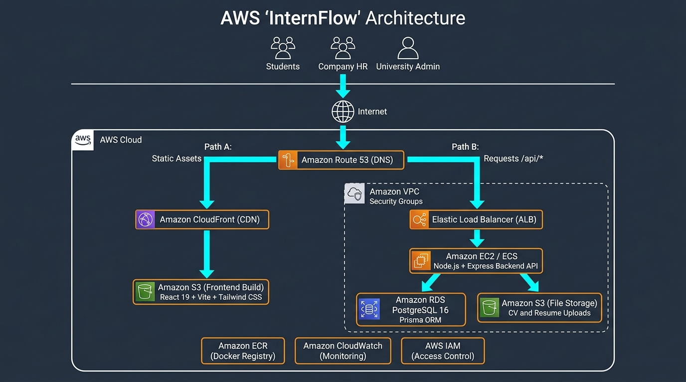

# 🎓💼 InternFlow — Multi-University Internship Management & Tracking Platform

A modern, cloud-based platform connecting students, university administrators, and company HR professionals into a single seamless workflow for finding, applying, managing, and evaluating internship placements — designed for deployment on **Amazon Web Services (AWS)**.

---

## ✨ Key Features

### 1. 🔍 Job Board & Application Pipeline
- **Centralized Job Board** — Students can browse, filter, and search active internship opportunities from partnered corporate employers in an interactive card view with working hours, stipend, and contact channels.
- **Job Editing & Rich Details** — Company HR can create, update, and manage job postings with working hours/schedule, allowance, contact info (Email, Phone, LINE ID), and career links.
- **One-Click Apply with AWS S3 Upload** — Seamless application submission with direct CV/Resume upload to Amazon S3 storage.
- **Real-Time Application Status Pipeline** — Multi-stage status lifecycle (`PENDING` ➔ `REVIEWING` ➔ `ACCEPTED` ➔ `APPROVED_BY_UNIVERSITY` or `REJECTED`).
- **Profile Management** — Dedicated profile pages for Students, Company HR, and University Admins.
- **Dynamic Role-Based Dashboards** — Tailored analytics, live statistics, and recent activity feeds for Students, Company HR, and University Admins (`/api/dashboard/stats`).

### 2. 📝 Operational Weekly Logbook & Journal
- **Dynamic Pin-Point Deliverables** — Students record itemized Planned Objectives and Actual Completed Deliverables with dynamic bullet lists.
- **Attendance & Work Modality** — Track work modality per week (`🏢 On-site`, `💻 Remote / WFH`, `🔄 Hybrid`).
- **Supervisor Tracking & Problem-Solving** — Log direct supervisor name, troubleshooting challenges/solutions, and technical growth.
- **Direct File Uploads & Labeled Artifacts** — Upload files (PDF reports, timesheets, images) directly or link external artifacts (GitHub Pull Requests, Figma designs, Google Docs) with custom labels.

### 3. 🔍 Dual Verification & Review Workflow
- **Full 7-Category Inspector Drawer** — Transparent review showing Planned Objectives, Tasks Done, Problems & Solutions, Key Learnings, Attached Artifacts & Files, Company Rating, and Faculty Remarks.
- **Company Mentor Sign-off & Weekly Rating** — Employers review weekly logs, award a 1–5 star weekly rating (★), provide mentor feedback, and sign off (`Approved by Company Mentor ✓`).
- **Faculty Advisor Academic Verification** — University staff inspect weekly records, provide academic advice, and verify curricular alignment (`Faculty Verified ✓`).

### 4. 🏆 Employer Rubric & University Academic Grading
- **3-Stage Employer Performance Rubric** — Companies evaluate interns on **Work Quality**, **Punctuality & Responsibility**, and **Communication & Teamwork** (1–5 Stars) with qualitative remarks.
- **Academic Letter Grading (A–F)** — University administrators assign official course letter grades (`A`, `B+`, `B`, `C+`, `C`, `D+`, `D`, `F`).
- **Official Completion Certificate & Report** — Printable official completion document (`window.print()`) consolidating verified hours, dual verification history, employer rubric scores, and university grading.

---

## 🏗️ Architecture



```text
┌──────────────────────────────────────────────────────────────────────────────────┐
│                                                                                  │
│   Users / Browsers (Students, Company HR, University Admin)                      │
│       │                                                                          │
│       ▼                                                                          │
│  ┌──────────┐                                                                    │
│  │ Route 53 │ (DNS Resolution)                                                   │
│  └────┬─────┘                                                                    │
│       │                                                                          │
│       ├─────────────────────────────────┐                                        │
│       │ Path A: Static Assets           │ Path B: API Requests (/api/*)          │
│       ▼                                 ▼                                        │
│  ┌─────────────┐               ┌──────────────────────────────────────────────┐  │
│  │ CloudFront  │ (Global CDN)  │                 Amazon VPC                   │  │
│  └────┬────────┘               │                                              │  │
│       │                        │   ┌──────────────────────────┐               │  │
│       ▼                        │   │  Elastic Load Balancer   │ (Public       │  │
│  ┌─────────────┐               │   │         (ALB)            │  Subnet)      │  │
│  │  Amazon S3  │ (Frontend     │   └──────────┬───────────────┘               │  │
│  │ (React App) │  Build)       │              │                               │  │
│  └─────────────┘               │   ┌──────────▼───────────────┐               │  │
│                                │   │     Amazon EC2 / ECS     │ (Private      │  │
│                                │   │  Node.js + Express API   │  Subnet)      │  │
│                                │   └──────────┬───────────────┘               │  │
│                                │              │                               │  │
│                                │   ┌──────────┴──────────┐                    │  │
│                                │   │                     │                    │  │
│                                │   ▼                     ▼                    │  │
│                                │ ┌─────────────────┐   ┌────────────────────┐ │  │
│                                │ │ Amazon RDS      │   │ Amazon S3          │ │  │
│                                │ │ PostgreSQL 16   │   │ (File Storage)     │ │  │
│                                │ │ (Prisma ORM)    │   │ (CV/Resume Upload) │ │  │
│                                │ └─────────────────┘   └────────────────────┘ │  │
│                                └──────────────────────────────────────────────┘  │
│                                                                                  │
│   Supporting Services: Amazon ECR ── Amazon CloudWatch ── AWS IAM                │
└──────────────────────────────────────────────────────────────────────────────────┘
```

---

## ☁️ AWS Cloud Technology Components

### Main Components (Standalone Managed Cloud Services)

| Component Name | Descriptions |
|---|---|
| **Amazon Route 53** | Domain Name System (DNS) service for domain name resolution and intelligent traffic routing. |
| **Amazon CloudFront** | Content Delivery Network (CDN) service caching and delivering frontend static assets globally. |
| **Amazon Simple Storage Service (S3)** | Scalable object storage service for frontend React hosting and student CV/resume/report file storage. |
| **Amazon Elastic Container Service (ECS)** | Fully managed container orchestration service running backend Node.js application containers. |
| **Amazon Elastic Container Registry (ECR)** | Fully managed Docker container registry for securely storing and managing application images. |
| **Amazon Relational Database Service (RDS)** | Managed database service running PostgreSQL 16 for all relational data (Users, Jobs, Applications, Logbooks). |
| **AWS Identity and Access Management (IAM)** | Centralized identity service managing access permissions, roles, and security credentials. |
| **Amazon CloudWatch** | Observability and monitoring service collecting application logs, performance metrics, and alarms. |

### Micro Components (Infrastructure & Networking Primitives)

| Component Name | Descriptions |
|---|---|
| **Amazon Virtual Private Cloud (VPC)** | Logically isolated virtual network boundary containing all backend compute and database resources. |
| **Elastic Load Balancing (ELB / ALB)** | Network appliance component distributing incoming API requests across backend container targets. |
| **Security Groups** | Stateful virtual firewalls controlling inbound/outbound port-level traffic for VPC resources. |
| **Amazon Machine Images (AMI)** | Pre-configured operating system template (Ubuntu Linux) used for provisioning compute instances. |

---

## 🛠️ Tech Stack

| Layer | Technology |
|---|---|
| **Frontend** | React 19, TypeScript, Vite, Tailwind CSS v4, Lucide React |
| **Backend** | Node.js, Express 5, TypeScript |
| **File Uploads** | Multer, AWS SDK v3 (`@aws-sdk/client-s3`), `multer-s3` |
| **Database & ORM** | PostgreSQL 16 on Amazon RDS + Prisma 7 ORM |
| **Application Hosting** | Amazon EC2 / Amazon ECS Fargate |
| **Frontend Hosting** | Amazon S3 + Amazon CloudFront CDN |
| **Load Balancer & DNS** | AWS Application Load Balancer (ALB) + Amazon Route 53 |
| **Containerization** | Docker + Docker Compose (local development & production) |
| **Project Management** | Jira Software (Agile Scrum Board & Sprint Tracking) |

---

## 🚀 Quick Start (Local Development)

### Prerequisites

- Node.js 20+
- Docker & Docker Compose
- AWS Account & Credentials (Optional for local dev, required for S3 uploads)

### Running with Docker Compose

```bash
# 1. Clone the repository
git clone https://github.com/Justsaucz/InternFlow.git
cd InternFlow

# 2. Configure environment variables
cp backend/.env.example backend/.env

# 3. Start all services (Database, Backend API, Frontend App, Prisma Studio)
docker compose up -d --build

# 4. Access the platform
# Frontend:      http://localhost:3000
# Backend API:   http://localhost:4000
# Prisma Studio: http://localhost:5555
```

---

## 🔗 REST API Endpoints

### Authentication & Profiles
- `POST /api/auth/register` — Register a new user (Student / Company HR / University Admin)
- `POST /api/auth/login` — Authenticate and receive JWT
- `GET /api/student/profile` — Fetch student academic profile
- `PUT /api/student/profile` — Update student profile & skills
- `GET /api/company/profile` — Fetch company profile & HR contact info
- `PUT /api/company/profile` — Update company profile & contact info
- `GET /api/admin/profile` — Fetch university profile & chair info
- `PUT /api/admin/profile` — Update university profile & chair info
- `GET /api/admin/students` — University student directory

### Job Postings & Applications
- `GET /api/jobs` — List all active job postings
- `POST /api/jobs` — Create a new job posting (HR only)
- `PUT /api/jobs/:id` — Edit an existing job posting (HR only)
- `DELETE /api/jobs/:id` — Delete a job posting (HR only)
- `GET /api/jobs/company` — List jobs posted by logged-in HR
- `POST /api/applications` — Apply to a job with CV upload
- `GET /api/applications/my` — Student view of submitted applications
- `GET /api/applications/company` — Company HR view of incoming applicants
- `PATCH /api/applications/:id/status` — Accept or Reject an applicant (HR)
- `PATCH /api/applications/:id/approve` — Final approval of placement (University Admin)

### Weekly Logbook & Dual Verification
- `POST /api/logbook` — Student creates or updates a weekly log with pin points & modality
- `GET /api/logbook/my` — Student fetches own weekly logbook entries & hour gauge
- `GET /api/logbook/student/:studentId` — Company HR or University Admin inspects student weekly logs
- `POST /api/logbook/approve/:id` — Company HR signs off on weekly log with 1–5★ rating & feedback
- `POST /api/logbook/verify/:id` — University Admin verifies weekly log with academic remarks
- `DELETE /api/logbook/:id` — Student deletes a weekly log entry
- `POST /api/upload` — Direct file upload endpoint (CVs, weekly logbook files, reports)

### Performance Evaluation & Grading
- `GET /api/evaluations/company/interns` — Active interns roster & evaluation statuses for HR
- `POST /api/evaluations/submit` — HR submits 3-category rubric evaluation (1–5★)
- `GET /api/evaluations/admin` — University-wide student placement tracking & evaluation overview
- `PUT /api/evaluations/:id/grade` — University Admin awards final letter grade (A–F)
- `GET /api/evaluations/report/:studentId` — Generate official printable internship completion report

---

## 👥 Team Responsibilities

| Person | Area |
|---|---|
| 1 | Frontend Dashboards (Student, HR, University UI) |
| 2 | Backend Auth, RBAC Logic & Security |
| 3 | Database Design (Prisma Schema) & Placement Workflows |
| 4 | File Upload Integration (Multer + AWS S3) |
| 5 | DevOps & AWS Cloud Infrastructure (EC2, RDS, S3, Docker) |
| 6 | Testing/QA, Logbook & Dual Verification System, Documentation |

---

## 📄 License

MIT
